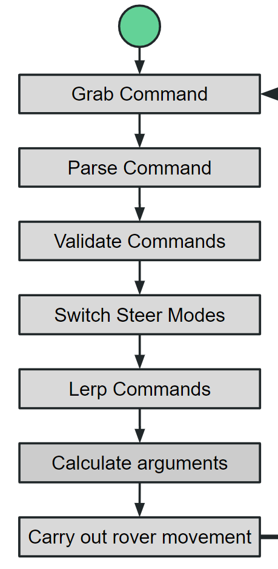

# Mars Rover Communications and Firmware

## Dev Environment Setup

## Linux

### Install Git
* This should be preinstalled
* If it isn't installed then run the following command
```
sudo apt install git
```

### Download VSCode
* To do so run the following commands 
```
sudo apt update
sudo apt install software-properties-common apt-transport-https wget
wget -q https://packages.microsoft.com/keys/microsoft.asc -O- | sudo apt-key add -
sudo add-apt-repository "deb [arch=amd64] https://packages.microsoft.com/repos/vscode stable main"
sudo apt install code
```
#### Download VSCode Extensions
* C/C++
* C/C++ Extension Pack
* Clang-Format
* Gitlens
* Liveshare
* Code Spell checker
* CMake
* CMake Tools

### Clone URC-Control-System-2023
* Run the following command in your terminal in the directory that you want to download the clone repository to: 
```
git clone https://github.com/SJSURoboticsTeam/urc-control-system-2023.git
```

### Libhal
* Goto the following link and follow the steps it tells you to: https://libhal.github.io/2.2/getting_started/

## Windows

### Install Git
* Navigate to the following link and download git: https://git-scm.com/download/win

### Download VSCode
* Navigate to the following link to download VSCode: https://code.visualstudio.com/download

#### Download VSCode Extensions
* C/C++
* C/C++ Extension Pack
* Clang-Format
* Gitlens
* Liveshare
* Code Spell checker
* CMake
* CMake Tools

### Clone URC-Control-System-2023
* Run the following command in your terminal in the directory that you want to download the clone repository to: 
```
git clone https://github.com/SJSURoboticsTeam/urc-control-system-2023.git
```
### Libhal
* Goto the following link and follow the steps it tells you to: https://libhal.github.io/2.2/getting_started/

## How to Build and Flash

1. Change into the directory you want to build
2. Run
   ```bash
   conan build . -pr lpc4078 -s build_type=MinSizeRel -b missing -c tools.build:jobs=1
   ```
3. Change into `build/lpc4078/Debug` directory
4. Change **FILE** and **SERIALPORT** with correct values then run 
   **Windows:**
   ```bash
   nxpprog --control --binary="lpc4078_**FILE**.elf.bin" --device="COM**SERIALPORT**"
   ```
   **MAC**:
   **Linux**:

If this doesn't work then look here for updated instructions: https://libhal.github.io/2.2/

## Code Structure

